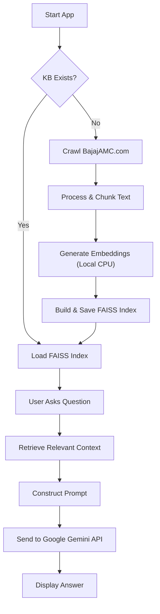

# Bajaj AMC AI Assistant

This project is a Retrieval-Augmented Generation (RAG) chatbot specifically designed to assist with **Bajaj AMC** queries. It crawls the official website, processes the content into a local knowledge base, and uses **Google's Gemini 2.5 Flash** model to answer user questions.

## Features

- **Focused Crawling**: Automatically crawls `https://www.bajajamc.com` (depth: 2) to build a specialized dataset.
- **Local Embeddings**: Uses `all-MiniLM-L6-v2` (Sentence Transformers) for free, local, and privacy-focused embeddings.
- **Storage Optimized**: Saves the AI models to a local cache directory (`./hf_cache`) to avoid filling up the system drive.
- **Vector Database**: Efficiently stores and retrieves relevant context using **FAISS**.
- **Smart Responses**: Powered by **Google Gemini 2.5 Flash** for high-quality, up-to-date answers.
- **Conversation Memory**: Remembers your chat history for a seamless experience.
- **Interactive UI**: Built with Streamlit for a clean and responsive user interface.

## Architecture



## Installation

1.  **Clone the repository:**

    ```bash
    git clone https://github.com/shlok029/bajaj-amc-chatbot.git
    cd bajaj-amc-chatbot
    ```

2.  **Install dependencies:**

    ```bash
    pip install -r requirements.txt
    ```

3.  **Set up Environment Variables:**
    - Create a `.env` file in the root directory.
    - Add your Google API Key (Get one from [Google AI Studio](https://aistudio.google.com/)):
      ```env
      GOOGLE_API_KEY=your_google_api_key_here
      ```

## Usage

1.  **Run the application:**

    ```bash
    streamlit run app.py
    ```

2.  **First Run:**

    - The app will automatically check for a Knowledge Base.
    - If missing, click **"Start Processing Website"** to crawl and build it.
    - _Note: First-time setup downloads the embedding model (~100MB) to the `hf_cache` folder._

3.  **Chat:**

    - Once initialized, ask any question related to Bajaj Mutual Funds, schemes, or services.

4.  **Rebuild:**
    - Use the "Rebuild Knowledge Base" button in the sidebar to refresh the data from the website.

## Technologies Used

- **Frontend:** Streamlit
- **LLM:** Google Gemini 2.5 Flash (`langchain-google-genai`)
- **Embeddings:** HuggingFace `all-MiniLM-L6-v2` (`sentence-transformers`)
- **Vector Store:** FAISS
- **Orchestration:** LangChain
- **Crawling:** Requests & BeautifulSoup

## Troubleshooting

- **"Paging file too small"**: This means your system is low on memory. We optimized this by caching the model locally, but try closing other apps if it persists.
- **API Quota Areas**: If you see a 429 error, you may have exceeded the free tier rate limit for Gemini. Wait a minute and try again.

## License

This project is open-source and available for educational purposes.
