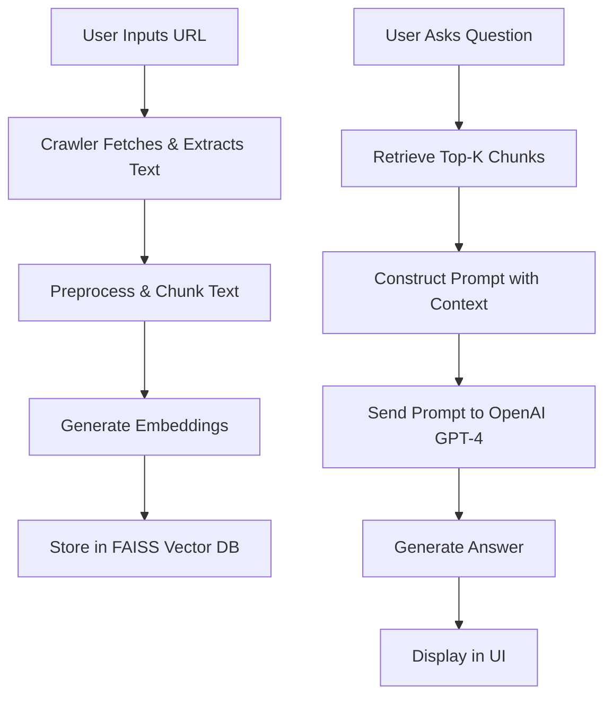

# RAG-Based Website Chatbot

This project implements a Retrieval-Augmented Generation (RAG) chatbot that can answer questions based on the content of any website. It crawls the provided URL, builds a knowledge base, and uses OpenAI's GPT-4 for generating answers.

## Features

- **Website Crawling**: Crawls websites up to 2 levels deep, extracting titles, headings, visible text, and links.
- **Knowledge Base Construction**: Processes text, chunks it, generates embeddings, and stores in FAISS vector database.
- **RAG Chatbot**: Retrieves relevant chunks and generates answers using OpenAI GPT-4.
- **User Interface**: Simple Streamlit UI for inputting URLs and chatting.
- **Error Handling**: Gracefully handles invalid URLs, blocked sites, and API errors.

## Architecture



## Installation

1. Clone or download the repository.
2. Install dependencies:
   ```
   pip install -r requirements.txt
   ```
3. Set up environment variables:
   - Copy `.env.example` to `.env`
   - Add your OpenAI API key: `OPENAI_API_KEY=your_api_key_here`

## Usage

1. Run the Streamlit app:
   ```
   streamlit run app.py
   ```
2. Open the provided URL in your browser.
3. Enter a website URL (e.g., https://www.example.com).
4. Click "Crawl & Build Knowledge Base".
5. Once built, ask questions in the chat interface.

## Example Queries

- "What is the main product offered?"
- "How does the company handle customer support?"
- "What are the key features listed?"

## Limitations

- Crawling is limited to 2 levels to avoid overloading servers.
- Large websites may take time to crawl and process.
- Requires OpenAI API key with sufficient credits.
- Does not handle JavaScript-rendered content.
- Ignores images, scripts, and ads as per requirements.

## Future Enhancements

- Add support for more LLM providers.
- Implement caching for crawled sites.
- Enhance crawling to handle dynamic content.
- Add multi-language support.
- Deploy to cloud platforms like Vercel or Streamlit Cloud.

## Deployment

### Streamlit Cloud
1. Push code to GitHub.
2. Connect to Streamlit Cloud.
3. Set `OPENAI_API_KEY` in secrets.

### Vercel
1. Use Vercel for static deployment, but since it's Streamlit, better to use Streamlit Cloud.

## Technologies Used

- Python
- Streamlit
- LangChain
- OpenAI GPT-4
- FAISS
- Sentence Transformers
- BeautifulSoup
- Requests